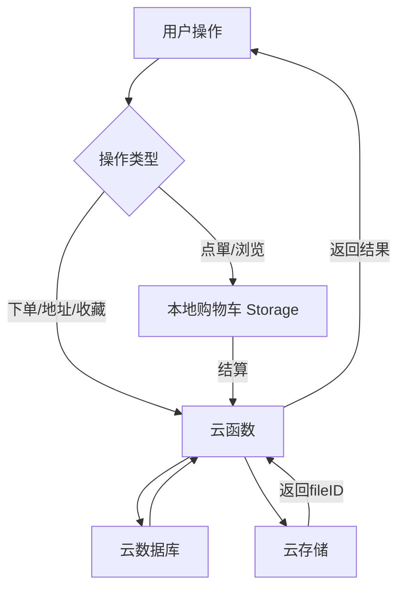

## 用户需求

开发一个微信小程序 + 微信云开发完整项目（奶茶点单系统），要求可直接运行、界面美观、功能完整、结构规范，可在微信开发者工具中直接打开运行。

## 产品概述

一款奶茶点单微信小程序，支持门店自取和外卖点单两种模式。用户可浏览店铺和饮品、加入购物车、下单结算；管理员可在"我的"页面管理饮品分类、饮品信息、查看订单、管理收货地址。支付功能暂不实现。

## 核心功能

### 底部三Tab页

- **首页**：展示首页大图，门店自取 + 外卖点單两个入口卡片，横向滚动推荐饮品
- **点單**：选择店铺（附近tab含地图+店铺列表+搜索；收藏tab含已收藏店铺），选择店铺后进入分类点单页，底部固定购物车入口（logo+数量+总金额+结算），购物车支持增删改清空，本地持久化
- **我的**：包含收货地址管理、饮品分类管理、饮品信息维护、订单管理四个功能入口

### 下单结算

- 堂食：联系电话、备注、取餐时间；外卖：联系电话、备注、送达时间、收货地址（新增/选择已有）
- 提交后生成订单号、状态（待确认/已完成/已取消），下单成功清空购物车
- 支持取消未确认订单、再次购买

### 收货地址管理

- 新增/编辑/删除地址，字段：收货人、性别、手机号、地址（地图选点）、门牌号、标签（家/公司/学校/其他）

### 管理功能

- 饮品分类管理：新增、编辑、删除（级联提示），显示名称、饮品数量、创建时间
- 饮品信息维护：选择分类后管理饮品，字段含名称、价格、图片、杯型、温度、甜度、备注、库存、上架状态
- 订单管理：全部/待确认/已完成/已取消，查看详情、再次购买、取消订单

### UI要求

- 主色调#FF7A2E，背景色#F7F8FA，卡片纯白，价格色#FF4D4F
- 卡片式布局，圆角16rpx，柔和阴影，按钮统一88rpx高度大圆角
- 流畅动画（推荐滚动、购物车飞入、按钮按压、页面淡入）
- 完善空状态、加载状态、错误提示、二次确认、表单验证

## 技术栈

- **前端**：微信小程序原生开发（WXML / WXSS / JavaScript）
- **后端**：微信云开发（云函数 Node.js + 云数据库 + 云存储）
- **地图**：微信内置 map 组件 + wx.getLocation + wx.chooseLocation
- **数据持久化**：购物车使用 wx.setStorageSync / wx.getStorageSync 本地存储
- **基础库版本**：2.25.0+

## 实现方案

### 整体架构

采用微信小程序原生开发 + 云开发模式。前端通过 tabBar 实现三个主Tab页（首页、点單、我的），管理类页面以子页面形式在"我的"Tab下跳转。云函数负责所有数据库操作和业务逻辑，保证数据安全和一致性。

### 数据库设计（5个集合）

1. **shops**（店铺）

- _id, name, address, latitude, longitude, phone, image, businessHours, status, createTime

2. **categories**（饮品分类）

- _id, name, sort, shopId, createTime

3. **drinks**（饮品）

- _id, name, categoryId, shopId, price, image, cupSizes[], temperatures[], sweetnesses[], description, stock, isOnShelf, createTime

4. **orders**（订单）

- _id, orderNo, shopId, shopName, orderType(dine-in/delivery), items[], totalPrice, contactPhone, remark, pickupTime/deliveryTime, addressId/addressInfo, status(pending/completed/cancelled), userId, createTime

5. **addresses**（收货地址）

- _id, userId, name, gender(male/female), phone, province, city, district, detail, roomNumber, latitude, longitude, tag(home/company/school/other), isDefault, createTime

6. **favorites**（店铺收藏）

- _id, userId, shopId, createTime

### 云函数设计（6个）

1. **shopManager**：获取店铺列表、搜索店铺、获取店铺详情
2. **drinkManager**：获取分类列表、获取饮品列表、搜索饮品、管理员CRUD分类和饮品
3. **orderManager**：创建订单、获取订单列表、获取订单详情、取消订单
4. **addressManager**：CRUD收货地址
5. **favoriteManager**：收藏/取消收藏、获取收藏列表
6. **initData**：初始化示例数据（店铺、分类、饮品），方便演示

### 关键技术决策

- **购物车本地化**：使用 localStorage 存储购物车数据，按 shopId 隔离，切换店铺时提示清空或保留
- **规格选择**：杯型/温度/甜度以数组形式存储在饮品数据中，用户点單时通过弹窗选择
- **图片上传**：使用云存储 wx.cloud.uploadFile 上传饮品和店铺图片
- **地图选点**：使用 wx.chooseLocation API 打开地图选择位置
- **附近店铺**：使用 wx.getLocation 获取用户位置，通过云函数计算距离排序
- **订单号生成**：云函数中使用时间戳 + 随机数生成唯一订单号
- **管理员判断**：通过云数据库管理员集合或配置简单管理员 openid 列表实现

## 数据流



## 目录结构

```
d:/milkTea/
├── app.js                          # [NEW] 小程序入口，云开发初始化，全局购物车管理
├── app.json                        # [NEW] 全局配置：tabBar(首页/点單/我的)、页面路由、窗口样式
├── app.wxss                        # [NEW] 全局样式：主题色变量、通用class、动画定义
├── project.config.json             # [NEW] 项目配置：appid、云函数目录、基础库版本
├── sitemap.json                    # [NEW] 站点地图配置
├── custom-tab-bar/                 # [NEW] 自定义底部TabBar组件
│   ├── index.js                    # TabBar逻辑：选中态切换
│   ├── index.json                  # 组件配置
│   ├── index.wxml                  # TabBar模板：首页/点單/我的三个Tab
│   └── index.wxss                  # TabBar样式：橙色主题、图标+文字
├── images/                         # [NEW] 静态图片资源（占位图、图标等）
├── pages/
│   ├── home/                       # [NEW] 首页Tab
│   │   ├── home.js                 # 首页逻辑：加载推荐饮品、入口跳转
│   │   ├── home.json               # 页面配置
│   │   ├── home.wxml               # 首页模板：轮播图、两个入口卡片、推荐饮品横向滚动
│   │   └── home.wxss               # 首页样式：大卡片布局、动画
│   ├── order/                      # [NEW] 点單Tab（店铺选择页）
│   │   ├── order.js                # 点單逻辑：附近/收藏Tab切换、加载店铺、搜索
│   │   ├── order.json              # 页面配置
│   │   ├── order.wxml              # 点單模板：Tab切换、地图、店铺列表
│   │   └── order.wxss              # 点單样式
│   ├── mine/                       # [NEW] 我的Tab
│   │   ├── mine.js                 # 我的逻辑：用户信息、功能入口
│   │   ├── mine.json               # 页面配置
│   │   ├── mine.wxml               # 我的模板：用户头像区、四个功能入口列表
│   │   └── mine.wxss               # 我的样式
│   ├── menu/                       # [NEW] 分类点單页（选择店铺后进入）
│   │   ├── menu.js                 # 点單逻辑：左侧分类、右侧饮品列表、加入购物车、规格选择
│   │   ├── menu.json               # 页面配置：引用购物车组件
│   │   ├── menu.wxml               # 点單模板：双栏布局、饮品卡片、底部购物车栏
│   │   └── menu.wxss               # 点單样式
│   ├── cart/                       # [NEW] 购物车页面
│   │   ├── cart.js                 # 购物车逻辑：增删改查、数量计算、清空、本地持久化
│   │   ├── cart.json               # 页面配置
│   │   ├── cart.wxml               # 购物车模板：商品列表、规格展示、底部结算栏
│   │   └── cart.wxss               # 购物车样式：滑动删除、数量调节器
│   ├── checkout/                   # [NEW] 下单结算页
│   │   ├── checkout.js             # 结算逻辑：堂食/外卖表单、地址选择、提交订单
│   │   ├── checkout.json           # 页面配置
│   │   ├── checkout.wxml           # 结算模板：商品清单、表单区域、地址选择、提交按钮
│   │   └── checkout.wxss           # 结算样式
│   ├── order-success/              # [NEW] 下单成功页
│   │   ├── order-success.js        # 成功页逻辑：显示订单信息、返回首页
│   │   ├── order-success.json
│   │   ├── order-success.wxml      # 成功页模板：成功动画、订单号、按钮
│   │   └── order-success.wxss
│   ├── address-list/               # [NEW] 收货地址列表页
│   │   ├── address-list.js         # 地址列表逻辑：加载、选择、删除
│   │   ├── address-list.json
│   │   ├── address-list.wxml       # 地址列表模板：地址卡片、新增按钮
│   │   └── address-list.wxss
│   ├── address-edit/               # [NEW] 新增/编辑收货地址页
│   │   ├── address-edit.js         # 地址编辑逻辑：地图选点、表单验证、保存
│   │   ├── address-edit.json
│   │   ├── address-edit.wxml       # 地址编辑模板：表单字段、地图选点按钮、标签选择
│   │   └── address-edit.wxss
│   ├── category-manage/            # [NEW] 饮品分类管理页
│   │   ├── category-manage.js      # 分类管理逻辑：CRUD、级联删除确认
│   │   ├── category-manage.json
│   │   ├── category-manage.wxml    # 分类列表模板：分类卡片、新增按钮
│   │   └── category-manage.wxss
│   ├── drink-manage/               # [NEW] 饮品信息维护页
│   │   ├── drink-manage.js         # 饮品管理逻辑：选择分类、CRUD、上下架
│   │   ├── drink-manage.json
│   │   ├── drink-manage.wxml       # 饮品列表模板：饮品卡片、状态切换、搜索
│   │   └── drink-manage.wxss
│   ├── drink-edit/                 # [NEW] 新增/编辑饮品页
│   │   ├── drink-edit.js           # 饮品编辑逻辑：图片上传、规格设置、表单验证
│   │   ├── drink-edit.json
│   │   ├── drink-edit.wxml         # 饮品编辑模板：图片上传、名称/价格/规格/库存表单
│   │   └── drink-edit.wxss
│   ├── order-list/                 # [NEW] 订单管理页
│   │   ├── order-list.js           # 订单列表逻辑：Tab切换、下拉刷新、取消订单
│   │   ├── order-list.json
│   │   ├── order-list.wxml         # 订单列表模板：Tab切换、订单卡片
│   │   └── order-list.wxss
│   └── order-detail/               # [NEW] 订单详情页
│       ├── order-detail.js         # 订单详情逻辑：查看详情、再次购买
│       ├── order-detail.json
│       ├── order-detail.wxml       # 订单详情模板：状态、商品清单、联系信息、操作按钮
│       └── order-detail.wxss
├── components/                     # [NEW] 自定义组件
│   ├── cart-bar/                   # 购物车底部栏组件
│   │   ├── cart-bar.js             # 购物车栏逻辑：数量/金额计算、点击展开/结算
│   │   ├── cart-bar.json
│   │   ├── cart-bar.wxml           # 购物车栏模板：logo、数量徽标、金额、结算按钮
│   │   └── cart-bar.wxss
│   ├── drink-card/                 # 饮品卡片组件
│   │   ├── drink-card.js
│   │   ├── drink-card.json
│   │   ├── drink-card.wxml         # 饮品卡片：图片、名称、价格、加入购物车按钮
│   │   └── drink-card.wxss
│   ├── spec-picker/                # 规格选择弹窗组件
│   │   ├── spec-picker.js          # 规格选择逻辑：杯型/温度/甜度选择、确认
│   │   ├── spec-picker.json
│   │   ├── spec-picker.wxml        # 规格选择模板：底部弹出、规格分组、数量选择
│   │   └── spec-picker.wxss
│   ├── empty-state/                # 空状态组件
│   │   ├── empty-state.js
│   │   ├── empty-state.json
│   │   ├── empty-state.wxml        # 空状态：图标 + 提示文字
│   │   └── empty-state.wxss
│   ├── confirm-dialog/             # 确认弹窗组件
│   │   ├── confirm-dialog.js
│   │   ├── confirm-dialog.json
│   │   ├── confirm-dialog.wxml
│   │   └── confirm-dialog.wxss
│   └── loading-toast/              # 加载提示组件
│       ├── loading-toast.js
│       ├── loading-toast.json
│       ├── loading-toast.wxml
│       └── loading-toast.wxss
└── cloudfunctions/                 # [NEW] 云函数目录
    ├── shopManager/                # 店铺管理云函数
    │   ├── index.js                # 获取店铺列表、搜索、详情
    │   └── package.json
    ├── drinkManager/               # 饮品管理云函数
    │   ├── index.js                # 分类CRUD、饮品CRUD、列表查询
    │   └── package.json
    ├── orderManager/               # 订单管理云函数
    │   ├── index.js                # 创建订单、列表查询、取消订单、详情
    │   └── package.json
    ├── addressManager/             # 地址管理云函数
    │   ├── index.js                # 地址CRUD
    │   └── package.json
    ├── favoriteManager/            # 收藏管理云函数
    │   ├── index.js                # 收藏/取消/列表
    │   └── package.json
    └── initData/                   # 初始化数据云函数
        ├── index.js                # 插入示例店铺、分类、饮品数据
        └── package.json
```

## 实施注意事项

- **购物车持久化**：使用 wx.setStorageSync('cart_' + shopId, cartData) 按 shopId 隔离存储，在 app.js 中提供全局 getCart/setCart 方法
- **性能**：饮品列表使用分页加载（每次20条），分类使用本地缓存减少云函数调用
- **图片**：饮品图片和店铺图片使用云存储，初始化数据中使用占位图片URL
- **地图权限**：需在 app.json 中声明 requiredPrivateInfos 包含 getLocation 和 chooseLocation
- **安全规则**：云数据库集合设置仅创建者可读写，订单和地址通过云函数操作（自带 openid 鉴权）
- **向后兼容**：预留支付接口字段（payStatus、payTime），后续可扩展

## 设计风格

采用温暖现代的餐饮风格，整体视觉以暖橙色为主调，搭配柔和浅灰背景和纯白卡片，营造温馨、清爽、有食欲的点餐体验。所有页面使用卡片式布局，圆角设计，柔和阴影，视觉高级舒适。

## 页面规划（6个核心页面）

### 1. 首页（Home Tab）

- **顶部Banner区**：大尺寸轮播图展示推荐饮品和促销活动，圆角卡片，左右滑动指示点
- **入口卡片区**：门店自取 + 外卖点喚两个大卡片并排，各自带图标和描述，点击有按压反馈动画
- **推荐饮品区**：横向滚动饮品卡片，每张卡片含图片、名称、价格，左侧标题"热门推荐"
- **底部留白**：为TabBar预留空间

### 2. 店铺选择页（Order Tab）

- **顶部Tab栏**：附近 | 收藏 两个Tab，选中态橙色下划线
- **地图区域**：顶部展示 map 组件，标记用户位置和附近店铺位置
- **搜索栏**：省份选择器 + 店铺名搜索输入框
- **店铺列表**：底部可滑动店铺卡片列表，每张含店铺图片、名称、地址、距离

### 3. 分类点喚页（Menu）

- **顶部店铺信息**：当前选择店铺名称和地址
- **左侧分类栏**：纵向分类列表，选中态橙色背景高亮
- **右侧饮品列表**：饮品卡片网格（两列），含图片、名称、价格、加入购物车按钮
- **底部购物车栏**：固定底部，购物车logo（带数量徽标）+ 总金额 + 去结算按钮

### 4. 我的页面（Mine Tab）

- **用户信息区**：头像、昵称、会员信息卡片，背景渐变橙色
- **功能入口列表**：四个功能卡片（收货地址管理、饮品分类管理、饮品信息维护、订单管理），图标 + 文字 + 箭头

### 5. 下单结算页（Checkout）

- **店铺信息卡片**：展示当前店铺名称和地址
- **商品清单**：已选商品列表，含规格、数量、小计
- **表单区域**：根据堂食/外卖动态显示不同字段，卡片式布局
- **地址选择卡片**（外卖模式）：点击展开地址列表，支持新增
- **底部结算栏**：固定底部，显示总价和提交订单按钮

### 6. 订单列表页（Order List）

- **顶部Tab栏**：全部 | 待确认 | 已完成 | 已取消
- **订单卡片**：订单号、时间、饮品缩略、金额、状态标签、操作按钮
- **空状态**：对应状态无订单时展示空状态插图和提示文字

## Agent Extensions

无需使用Agent Extensions，本项目为从零创建的微信小程序项目，不涉及代码探索或外部工具集成。